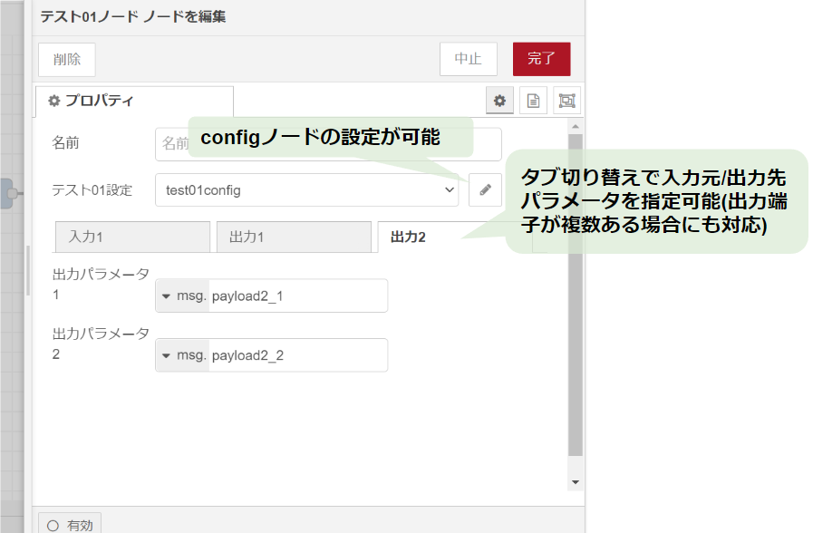
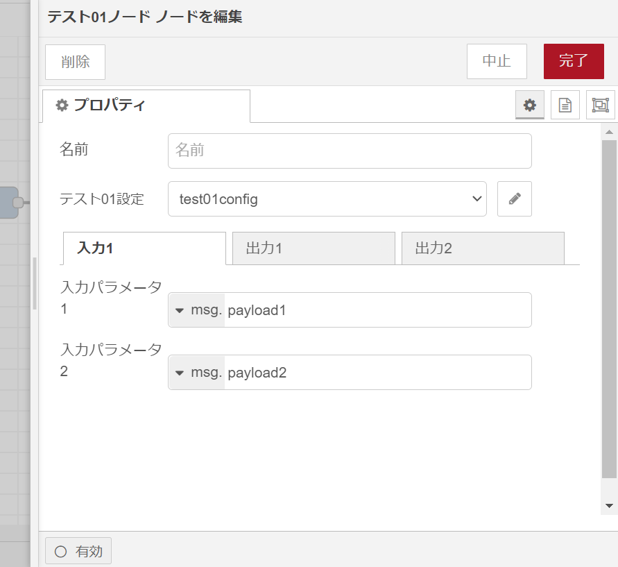
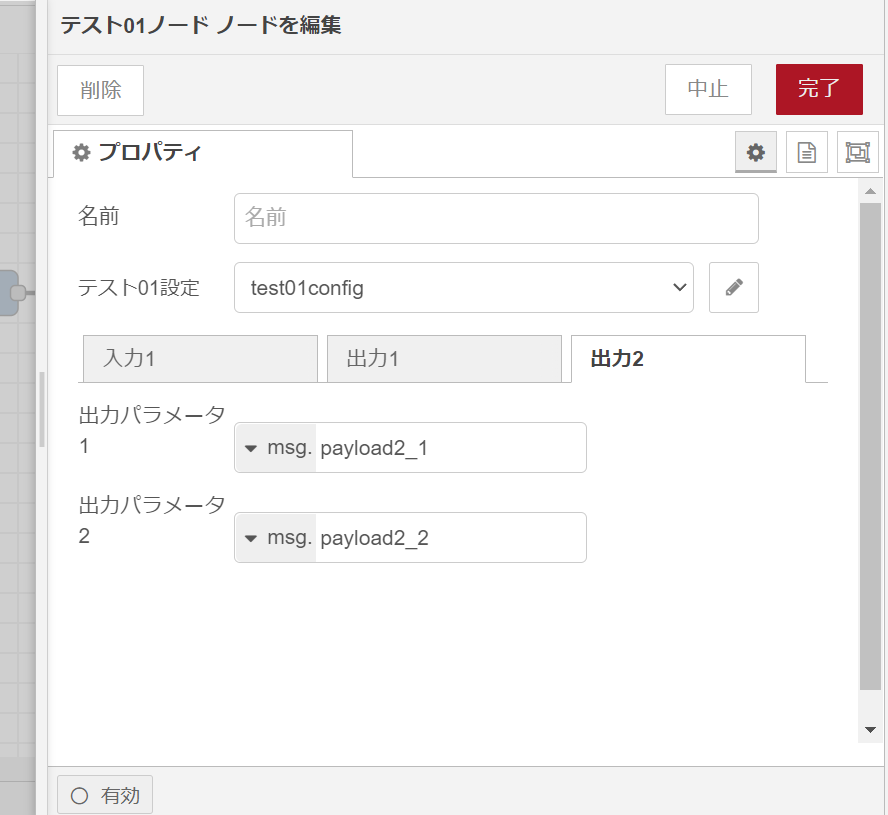

# create-node-red-node

## 概要

create-node-red-nodeは、Node-REDのノードの開発を簡単に始められるように、ノードのテンプレートとなるTypeScriptプログラムを出力するCLIツールです。
出力されたフォルダを、Visual Studio Codeで開いて必要な処理を追加してください。
Node-REDノードの作成方法については以下が参考になるかと思います。

[はじめてのノード開発](https://nodered.jp/docs/creating-nodes/first-node)

このツールを用いると以下に示す特徴を持ったノードのテンプレートを作成できます。

* 入力元のパラメータと出力先のパラメータをプロパティ画面から指定できます(一般的にはmsg.payloadによりノードへの入力やノードからの出力を行いますが、これだと何らかのノードを呼び出すたびにchangeノードなどを使ってpayloadへの入力パラメータのセットや出力パラメータの退避を行う必要があるためノードのプロパティにて入力元と出力先のパラメータを設定できるようにしました)
* プロパティ画面のラベルなどの文字列は多言語化できます(現状はen-USとjaのみ)
* configノードを利用できます(configノードのテンプレートも一緒に出力します)



## 使い方

### 作成するノードの定義

作成するノードの定義を記載したファイルを用意してください。
定義はJSONで記載します。
以下にサンプルおよび説明を示します。

[ノード定義ファイルの例](#ノード定義ファイルの例)

### ノードテンプレート作成

以下のコマンドでノードテンプレートの定義に従ってノードテンプレートを作成します。

```
npx @hidetak/create-node-red-node <ノードテンプレート出力先フォルダ名> <ノードテンプレートの定義>`
```

例:
```
$ npx @hidetak/create-node-red-node test01-node node-gen-config.json
```

### ノードテンプレートのビルド

出力されたノードテンプレートのフォルダをVisual Studio Codeで開いてノードの開発を進めてください。
開発したノードは以下の手順でビルドします。

- 作成されたフォルダに移動します。  
  `cd <ノードテンプレート出力先フォルダ名>`
- ノードモジュールをインストールします。  
  `npm install`
- ビルドします。  
  `npm run build`

## ノードテンプレートの機能と定義の仕方

create-node-red-nodeでは出力するノードテンプレートは、JSONファイルで定義できます。

### ノードの基本定義

JSONファイルで、ノードモジュールのパッケージ定義や、ノード名やアイコンなどの定義を行います。

```
  "packageName": "node-red-contrib-test01-node",  // パッケージ名
  "nodeType": "test01-node",  // ノードタイプ
  "nodeName": "Test01Name",   // ノード名(関数名として利用)
  "category": "test", // パレットにノードを表示する際のカテゴリ
  "color": "#d7d7a0", // ノードの色
  "icon": "arrow.png", // ノードに表示するアイコン
  "paletteLabel__enUS": "test01 node", // パレットに表示するラベル(英語)
  "paletteLabel__ja": "テスト01ノード", // パレットに表示するラベル(日本語)
  "labelStyle": "node_label_italic", // ラベルの書体
```

### ロケール毎のメッセージカタログ/ヘルプの出力

ノードのプロパティ画面や、ヘルプ画面は多言語化できます。
多言語化できる項目は、項目名の末尾に`__enUS`(英語)や`__ja`(日本語)が付きます。

以下に例を示します。

```
  "paletteLabel__enUS": "test01 node",
  "paletteLabel__ja": "テスト01ノード",
```

メッセージカタログ/ヘルプの出力先は以下です。

```
<ノードテンプレート出力先フォルダ名>
  |- locales
      |- en-US
          |- <nodeType>.html 　ノードのヘルプ(英語)
          |- c<nodeType>.json 　ノードのメッセージカタログ(英語)
          |- <onfigノードのnodeType>.html 　configノードのヘルプ(英語)
          |- <onfigノードのnodeType>.json 　configノードのメッセージカタログ(英語)
      |- ja
          |- <nodeType>.html 　ノードのヘルプ(日本語)
          |- c<nodeType>.json 　ノードのメッセージカタログ(日本語)
          |- <onfigノードのnodeType>.html 　configノードのヘルプ(日本語)
          |- <onfigノードのnodeType>.json 　configノードのメッセージカタログ(日本語)
```

### 入力パラメータの取得元を指定可能  

ノードのプロパティ画面で、パラメータの入力元を選択できます。入力されたデータは、`node.inParams_<変数名>`で取得できますので、ユーザーはこの値を使ってプログラムを記載してください。入力元は複数指定することもできます(以下にプロパティ画面の例を示します)。
  
選択されたパラメータのデータは、ノードへのinputイベントが発生した際に、`node.inParams_<パラメータ名>`に格納します。適宜、利用して処理を記述してください。

JSONファイルの定義の仕方を以下に示します。

```
  "input": {
    "tabLabel__enUS": "Input1",  // 入力パラメータを設定するタブのラベル(英語)
    "tabLabel__ja": "入力1",  // 入力パラメータを設定するタブのラベル(日本語)
    "params": [ // 入力パラメータの定義(複数定義可能)
      {
        "name": "inputParam1",  // パラメータ名
        "label__enUS": "Input Parameter1",  // パラメータラベル(英語)
        "label__ja": "入力パラメータ1", // パラメータラベル(日本語)
        "description__enUS": "Input Parameter1 description.", // パラメータの説明(英語)
        "description__ja": "入力パラメータ1の説明。", // パラメータの説明(日本語)
        "placeholder__enUS": "Input Parameter1", // パラメータのプレースホルダー(英語)
        "placeholder__ja": "入力パラメータ1", // パラメータのプレースホルダー(日本語)
        "types": ["str", "env", "msg"], // 入力パラメータの種類
        "defaultType": "msg", // デフォルトの入力パラメータの種類
        "defaultValue": "payload1", // デフォルトの入力パラメータ
        "required": true  // 必須かどうか
      },・・・
    ]
  },
```

### 出力パラメータの保存先を指定可能    

ノードのプロパティ画面で、パラメータの出力先を選択できます(以下にプロパティ画面の例を示します)。

ノードへのinputイベントをトリガーとする処理で、選択された出力先にデータを格納するには以下のように定義します。  
```
  setOutput(
    config.outParams<出力番号>_<変数名>Type,
    config.outParams<出力番号>_<変数名>ConstValue,
    msg,
    this.context(),
    <出力するデータ>
  )
```
出力端子毎に複数の出力パラメータを指定できます。

JSONファイルの定義の仕方を以下に示します。

```
  "outputs": [
    {
      "tabLabel__enUS": "Output1",  // 出力パラメータを設定するタブのラベル(英語)
      "tabLabel__ja": "出力1",  // 出力パラメータを設定するタブのラベル(日本語)
      "outputLabel__enUS": "Output1", // 出力端子のラベル(英語)
      "outputLabel__ja": "出力1", // 出力端子のラベル(日本語)
      "params": [ // 出力パラメータの定義(複数定義可能)
        {
          "name": "output1",  // パラメータ名
          "label__enUS": "Output Parameter1",  // パラメータラベル(英語)
          "label__ja": "出力パラメータ1",  // パラメータラベル(日本語)
          "description__enUS": "Output Parameter1 description.", // パラメータの説明(英語)
          "description__ja": "出力パラメータ1の説明。", // パラメータの説明(日本語)
          "placeholder__enUS": "Output Parameter1", // パラメータのプレースホルダー(英語)
          "placeholder__ja": "出力パラメータ1", // パラメータのプレースホルダー(日本語)
          "types": ["msg", "flow"], // 出力パラメータの種類
          "defaultType": "msg", // デフォルトの出力パラメータの種類
          "defaultValue": "payload1_1" // デフォルトの出力パラメータ
        }
      ]
    },・・・
  ],
```

### configノードを含むノード

Node-REDにはconfigノードと呼ぶ設定情報を保持するノードがあります。configノードを利用すると、複数のノードで同じ設定を共有でき、設定情報の管理が容易になります。

ノード設定ファイルでの設定例を示します。

```
"config": {
  "nodeType": "test01-config",   // ノードタイプ
  "nodeName": "Test01Config",    // ノード名
  "defaultName": "test01config", // ノードのデフォルト名(名前を指定しなかった場合の名前)
  "configLabel__enUS": "test01 config",  // プロパティ画面に表示するラベル(英語)
  "configLabel__ja": "テスト01設定",      // プロパティ画面に表示するラベル(日本語)
  "labelStyle": "node_label_italic",     // ラベルの書体
  "settings": [  // configノードに保持する定義(複数定義可能)
    {
      "name": "config1", // 定義の変数に利用する名前
      "label__enUS": "config1", // プロパティ画面に表示するラベル(英語)
      "label__ja": "設定1",  // プロパティ画面に表示するラベル(日本語)
      "description__enUS": "config1 description.", // ヘルプに記載する説明(英語)
      "description__ja": "設定1の説明。",   // ヘルプに記載する説明(日本語)
      "types": ["str", "env", "flow"], //設定を入力するときに利用するTypedInputの種類一覧
      "defaultType": "env",  // デフォルトのTypedInputの種類
      "defaultValue": "test1env",  // デフォルトの値
      "placeholder__enUS": "test01 config",  // プレースフォルダ(英語)
      "placeholder__ja": "テスト01設定", // プレースフォルダ(日本語)
      "required": true  // 必須かどうか
    },・・・
  ]
}
```

# 付録

## ノード定義ファイルの例

```
{
    "packageName": "node-red-contrib-test01-node",
    "nodeType": "test01-node",
    "nodeName": "Test01Name",
    "category": "test",
    "color": "#d7d7a0",
    "icon": "arrow.png",
    "paletteLabel__enUS": "test01 node",
    "paletteLabel__ja": "テスト01ノード",
    "labelStyle": "node_label_italic",
    "input": {
        "tabLabel__enUS": "Input1",
        "tabLabel__ja": "入力1",
        "params": [
            {
                "name": "inputParam1",
                "label__enUS": "Input Parameter1",
                "label__ja": "入力パラメータ1",
                "description__enUS": "Input Parameter1 description.",
                "description__ja": "入力パラメータ1の説明。",
                "placeholder__enUS": "Input Parameter1",
                "placeholder__ja": "入力パラメータ1",
                "types": ["str", "env", "msg"],
                "defaultType": "msg",
                "defaultValue": "payload1",
                "required":true
            },
            {
                "name": "inputParam2",
                "label__enUS": "Input Parameter2",
                "label__ja": "入力パラメータ2",
                "description__enUS": "Input Parameter2 description.",
                "description__ja": "入力パラメータ2の説明。",
                "placeholder__enUS": "Input Parameter2",
                "placeholder__ja": "入力パラメータ2",
                "types": ["str", "env", "msg"],
                "defaultType": "msg",
                "defaultValue": "payload2",
                "required":true
            }
        ]
    },
    "outputs": [
        {
            "tabLabel__enUS": "Output1",
            "tabLabel__ja": "出力1",
            "outputLabel__enUS": "Output1",
            "outputLabel__ja": "出力1",
            "params": [
                {
                    "name": "output1",
                    "label__enUS": "Output Parameter1",
                    "label__ja": "出力パラメータ1",
                    "description__enUS": "Output Parameter1 description.",
                    "description__ja": "出力パラメータ1の説明。",
                    "placeholder__enUS": "Output Parameter1",
                    "placeholder__ja": "出力パラメータ1",
                    "types": ["msg", "flow"],
                    "defaultType": "msg",
                    "defaultValue": "payload1_1",
                    "required":true
                }
            ]
        },
        {
            "tabLabel__enUS": "Output2",
            "tabLabel__ja": "出力2",
            "outputLabel__enUS": "Output2",
            "outputLabel__ja": "出力2",
            "params": [
                {
                    "name": "output1",
                    "label__enUS": "Output Parameter1",
                    "label__ja": "出力パラメータ1",
                    "description__enUS": "Output Parameter1 description.",
                    "description__ja": "出力パラメータ1の説明。",
                    "placeholder__enUS": "Output Parameter1",
                    "placeholder__ja": "出力パラメータ1",
                    "types": ["msg", "flow"],
                    "defaultType": "msg",
                    "defaultValue": "payload2_1",
                    "required":true
                },
                {
                    "name": "output2",
                    "label__enUS": "Output Parameter2",
                    "label__ja": "出力パラメータ2",
                    "description__enUS": "Output Parameter2 description.",
                    "description__ja": "出力パラメータ2の説明。",
                    "placeholder__enUS": "Output Parameter2",
                    "placeholder__ja": "出力パラメータ2",
                    "types": ["msg", "flow"],
                    "defaultType": "msg",
                    "defaultValue": "payload2_2",
                    "required":true
                }
            ]
        }
    ],
    "config": {
        "nodeType": "test01-config",
        "nodeName": "Test01Config",
        "defaultName": "test01config",
        "configLabel__enUS": "test01 config",
        "configLabel__ja": "テスト01設定",
        "labelStyle": "node_label_italic",
        "settings": [
            {
                "name": "config1",
                "label__enUS": "config1",
                "label__ja": "設定1",
                "description__enUS": "config1 description.",
                "description__ja": "設定1の説明。",
                "types": ["str", "env", "flow"],
                "defaultType": "env",
                "defaultValue": "test1env",
                "placeholder__enUS": "test01 config",
                "placeholder__ja": "テスト01設定",
                "required": true
            },
            {
                "name": "config2",
                "label__enUS": "config2",
                "label__ja": "設定2",
                "description__enUS": "config2 description.",
                "description__ja": "設定2の説明。",
                "types": ["str", "env", "flow"],
                "defaultType": "env",
                "defaultValue": "test2env",
                "placeholder__enUS": "test02 config",
                "placeholder__ja": "テスト02設定",
                "required": true
            }
        ]
    }
}
```
